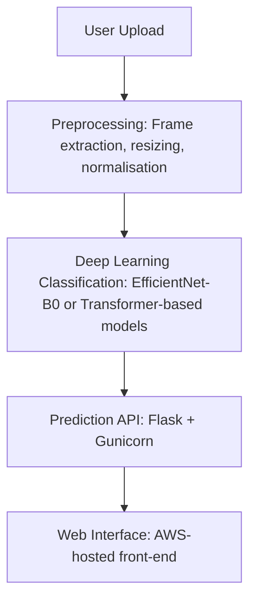

# **Deepfake Detection System**


This repository contains the implementation of a **Deepfake Detection Framework** leveraging **state-of-the-art deep learning models**. The system is capable of analysing both **images and videos** to classify media as **authentic or manipulated**, offering a robust tool for tackling misinformation and digital forgery.

The application is deployed as a **user-friendly web platform** on **Amazon Web Services (AWS)**, enabling accessibility for **journalists, educators, policymakers, and content moderators**.

---

🔑 Key Features

**Deep Learning Classifier**

* Baseline model: **EfficientNet-B0** trained on benchmark deepfake datasets.
* Extendable to **hybrid CNN-Transformer architectures** and attention-based spatiotemporal models.

**Multi-Modal Detection**

* Handles **image classification** and **video frame-wise analysis**.
* Incorporates **preprocessing pipelines** (frame extraction, resizing, normalisation, optional face detection).

**Deployment & Usability**

* **AWS-hosted web application** for real-world scalability.
* Interactive **Flask + Gunicorn API** backend with a lightweight **HTML/CSS front-end**.

**Ethical Design Principles**

* Transparent workflow with interpretable outputs.
* Consideration of **dataset bias, compression artefacts, and demographic fairness**.

---

📦 Model Storage

Due to GitHub’s **100 MB file size limit**, trained model checkpoints are not stored in this repository. Instead:

* OneDrive: [Download Here](https://uweacuk-my.sharepoint.com/:f:/g/personal/aghilesh2_valathuvalappil_live_uwe_ac_uk/Ep21zY7vEDVJklJsr3B1V_MB1t3YhKMGW2HJobj4oeP7nw?e=syqHSK)
* Google Drive: [Download Here](https://drive.google.com/drive/folders/1dWQzAWDd3fo69eTRsi_Ep_YFiZGhUtFP?usp=sharing)

After downloading, place the file inside the `models/` directory as:

```
models/deepfake_detector.pt
```

---

⚙️ Usage Instructions

**Clone the repository**

* Get a local copy of the project.

**Set up the environment**

* Create a virtual environment (recommended).
* Install dependencies from `requirements.txt`.

**Obtain the trained model**

* Download from OneDrive or Google Drive (links above).
* Place inside the `models/` directory.

**Run the application locally**

* Start the app:

  ```
  python app.py
  ```
* Access at: [http://127.0.0.1:5000](http://127.0.0.1:5000).

**Access via AWS (Recommended)**

* A fully deployed version is live on AWS.
* Simply open the link in your browser, upload an image or video, and view results.

---

📊 System Workflow



---

🖥️ Project Structure

```
deepfake_app/
│── models/                # Pretrained model checkpoints (deepfake_detector.pt)
│── static/                # Uploaded media, processed outputs, CSS
│── templates/             # HTML templates (index.html, results.html)
│── app.py                 # Flask application entry point
│── model_loader.py        # Model loading and inference logic
│── utils.py               # Preprocessing utilities (frame extraction, face detection)
│── requirements.txt       # Python dependencies
│── README.md              # Project documentation
```

---

📌 Future Improvements

* Integration of **Transformer-based models** for better temporal feature extraction.
* Implementation of **object-level forgery detection** (e.g., swapped backgrounds, manipulated artefacts beyond facial regions).
* Deployment of a **REST API endpoint** for third-party integrations.
* Enhanced interpretability with **heatmaps and Grad-CAM visualisations**.

---

👨‍💻 Author

**Aghilesh Valathu Valappil**
MSc Data Science – CSCT Masters Project
